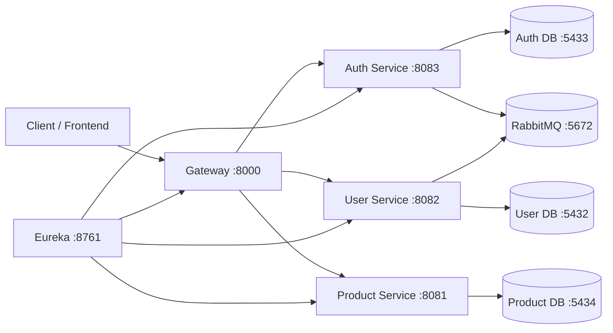

# Core Hub

<div align="center">


</div>

<p align="center">
  <strong>Microsserviços modernos em Java para autenticação, usuários, produtos e roteamento centralizado.</strong>
</p>

## ✨ Visão geral

O Core Hub é uma solução de microsserviços construída em Java com Spring Boot, Spring Cloud Gateway e Netflix Eureka. A arquitetura foi pensada para separar responsabilidades por domínio e permitir escalabilidade, isolamento de infraestrutura e comunicação assíncrona entre serviços.

### O que o projeto entrega

- autenticação e autorização com JWT
- gestão de usuários e papéis
- gerenciamento de produtos
- API Gateway único para entrada externa
- descoberta dinâmica de serviços via Eureka
- bancos PostgreSQL isolados por domínio
- mensageria com RabbitMQ

## 🏗️ Arquitetura do sistema



### Fluxo principal

1. O cliente acessa o gateway em `:8000`.
2. O gateway roteia a requisição para o microsserviço correto.
3. Os serviços se registram em `discovery` e são descobertos dinamicamente.
4. O serviço de autenticação gerencia JWT e refresh token.
5. Eventos de usuário e papéis são enviados via RabbitMQ.
6. Cada domínio mantém seu banco e suas regras de negócio separadas.

## 🧩 Stack tecnológica

| Categoria | Tecnologia |
| --- | --- |
| Linguagem | Java 21 |
| Framework | Spring Boot 3 |
| Gateway | Spring Cloud Gateway |
| Service Discovery | Netflix Eureka |
| Segurança | Spring Security + JWT |
| Banco de dados | PostgreSQL 17 |
| Mensageria | RabbitMQ |
| Infraestrutura | Docker Compose |
| Build | Maven Wrapper |

## 🚀 Serviços e portas

| Serviço | Porta local | Função |
| --- | ---: | --- |
| `discovery` | 8761 | Servidor Eureka |
| `gateway` | 8000 | Entrada principal da API |
| `auth-service` | 8083 | Cadastro, login, refresh e logout |
| `user-service` | 8082 | CRUD de usuários e papéis |
| `product-service` | 8081 | CRUD de produtos |
| `user-db` | 5432 | Banco de usuários |
| `auth-db` | 5433 | Banco de autenticação |
| `product-db` | 5434 | Banco de produtos |
| `rabbitmq` | 5672 | Broker de mensagens |
| `rabbitmq UI` | 15672 | Administração do RabbitMQ |
| `pgadmin` | 5050 | Administração do PostgreSQL |

## 📁 Estrutura do repositório

```text
core-hub/
├── docker-compose.yaml
├── start-all.sh
├── README.md
├── discovery/
│   ├── src/
│   ├── pom.xml
│   └── mvnw
├── gateway/
│   ├── src/
│   ├── pom.xml
│   └── mvnw
├── auth-service/
│   ├── src/
│   ├── pom.xml
│   └── mvnw
├── user-service/
│   ├── src/
│   ├── pom.xml
│   └── mvnw
├── product-service/
│   ├── src/
│   ├── pom.xml
│   └── mvnw
├── .logs/
├── .gitignore
└── .env.example (se aplicável no seu ambiente)
```

## ⚡ Execução rápida

### 1) Subir infraestrutura e serviços

```bash
chmod +x start-all.sh
./start-all.sh
```

Esse script realiza automaticamente:

- valida Java e Docker
- inicia os containers do Docker Compose
- aguarda Redis/Postgres/RabbitMQ e portas críticas
- inicia os microsserviços Spring Boot na ordem correta
- mantém os logs em `.logs/`

### 2) Execução manual

```bash
docker compose -f docker-compose.yaml up -d
```

Depois, em cada serviço:

```bash
cd discovery && ./mvnw spring-boot:run
cd user-service && ./mvnw spring-boot:run
cd auth-service && ./mvnw spring-boot:run
cd product-service && ./mvnw spring-boot:run
cd gateway && ./mvnw spring-boot:run
```

> A ordem recomendada é: discovery → serviços de negócio → gateway.

## 🌐 Endpoints principais

### Autenticação

Base URL: `http://localhost:8000/auth`

| Método | Endpoint | Descrição |
| --- | --- | --- |
| `POST` | `/auth/register` | Cria um novo usuário |
| `POST` | `/auth/login` | Realiza login |
| `POST` | `/auth/refresh` | Renovação do token |
| `POST` | `/auth/logout` | Encerra sessão |

Exemplo de login:

```bash
curl -X POST http://localhost:8000/auth/login \
  -H 'Content-Type: application/json' \
  -d '{
    "email": "admin@admin.com",
    "password": "123456"
  }'
```

### Usuários

Base URL: `http://localhost:8000/users`

| Método | Endpoint | Descrição |
| --- | --- | --- |
| `POST` | `/users` | Criar usuário |
| `GET` | `/users/me` | Perfil do usuário autenticado |
| `GET` | `/users/{id}` | Buscar por ID |
| `GET` | `/users` | Listar usuários |
| `PUT` | `/users/{id}` | Atualizar usuário |
| `DELETE` | `/users/{id}` | Remover usuário |
| `PATCH` | `/users/{id}/role` | Atualizar papel |

### Produtos

Base URL: `http://localhost:8000/products`

| Método | Endpoint | Descrição |
| --- | --- | --- |
| `POST` | `/products` | Criar produto |
| `GET` | `/products/{id}` | Buscar produto por ID |
| `GET` | `/products` | Listar produtos |
| `PUT` | `/products/{id}` | Atualizar produto |
| `DELETE` | `/products/{id}` | Remover produto |

## 🔐 Segurança e gateways

A rota externa da aplicação passa pelo gateway, que centraliza o tráfego e oferece uma camada simples de proteção:

- `/auth/**` → `lb://AUTH-SERVICE`
- `/users/**` → `lb://USER-SERVICE`
- `/products/**` → `lb://PRODUCT-SERVICE`

Características:

- CSRF desabilitado para integrações de API
- CORS ativo
- endpoints de health permitidos
- autenticação exposta de forma centralizada

## 📡 Mensageria e integração assíncrona

Os serviços de autenticação e usuários utilizam RabbitMQ para comunicação assíncrona e desacoplamento de eventos. Essa abordagem ajuda a manter os microsserviços independentes e preparados para evolução.

## 🗄️ Persistência por domínio

Cada serviço possui seu próprio banco PostgreSQL:

- `user_db`
- `auth_db`
- `product_db`

Esse padrão reduz acoplamento e facilita a expansão horizontal sem afetar outros domínios.

## 🧰 Interfaces administrativas

### Eureka dashboard

```text
http://localhost:8761
```

### RabbitMQ Management

```text
http://localhost:15672
```

Credenciais:

```text
username: guest
password: guest
```

### PGAdmin

```text
http://localhost:5050
```

Credenciais padrão:

```text
email: admin@admin.com
password: admin
```

## 📊 Observabilidade e logs

Os logs são armazenados em:

```text
./.logs/
```

Arquivos esperados:

- `discovery.log`
- `user-service.log`
- `auth-service.log`
- `product-service.log`
- `gateway.log`

## 🛠️ Troubleshooting

### Portas em uso

```bash
lsof -i :8000
lsof -i :8761
lsof -i :5432
lsof -i :5433
lsof -i :5434
lsof -i :5672
```

### Docker não inicia

```bash
docker ps
```

### Serviços não aparecem no Eureka

Verifique:

- se `discovery` foi iniciado antes dos outros serviços
- se o cliente Eureka está presente no `pom.xml`
- se a URL de registro está correta

### Banco ou RabbitMQ indisponível

```bash
docker compose ps
```

## 🚀 Roadmap

- autenticação mais granular por roles e permissões
- documentação OpenAPI/Swagger
- testes de integração por serviço
- monitoramento com Prometheus + Grafana
- pipeline CI/CD
- cache distribuído e otimizações de performance

## 📌 Conclusão

O Core Hub é uma base sólida para uma aplicação moderna em microsserviços, com foco em organização, isolamento de responsabilidades e facilidade de expansão. Ele representa uma arquitetura prática para sistemas que precisam evoluir com segurança e previsibilidade.

Para iniciar o ambiente de desenvolvimento:

```bash
chmod +x start-all.sh
./start-all.sh
```

Acesse rapidamente:

- Gateway: `http://localhost:8000`
- Eureka: `http://localhost:8761`
- RabbitMQ UI: `http://localhost:15672`
- PGAdmin: `http://localhost:5050`
